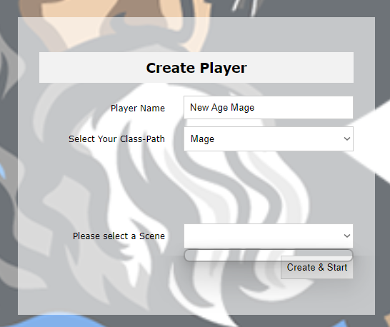
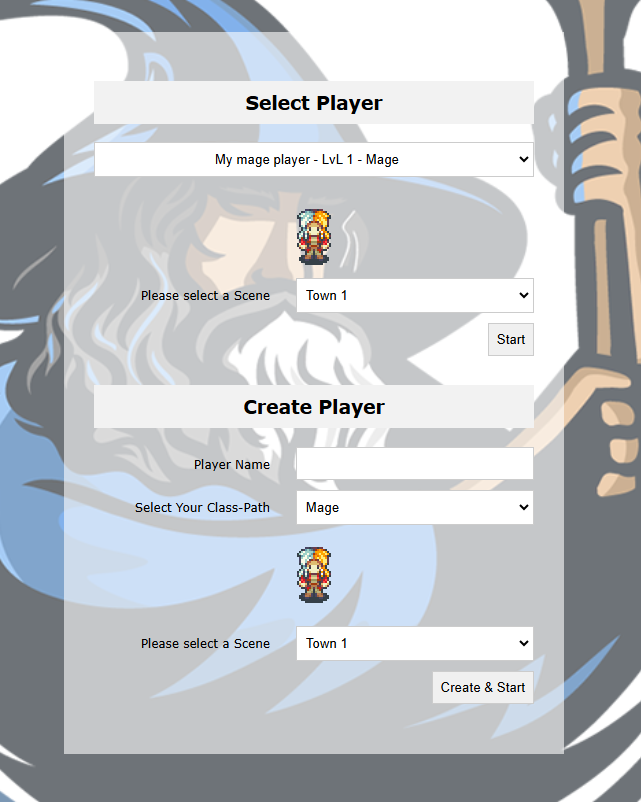
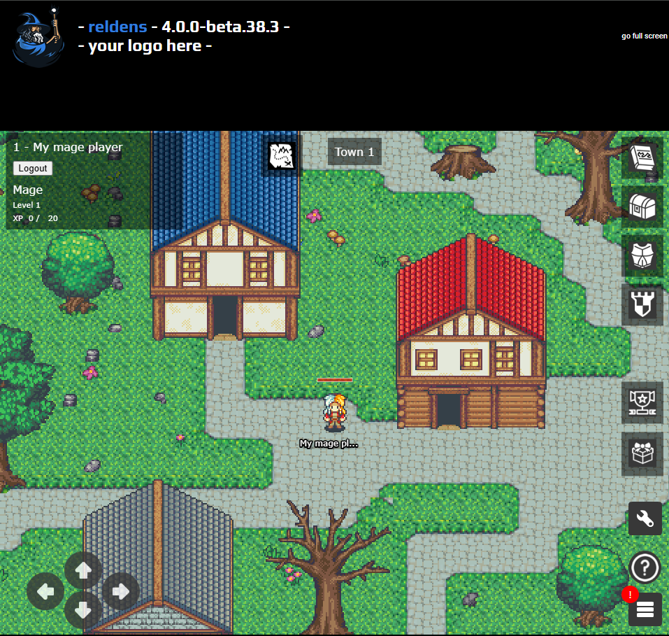
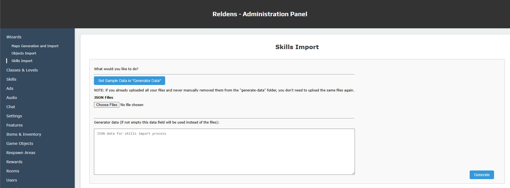

## Contents creation

Note: though is recommended to learn the info in the links below, you don't need to read all of them now to follow the content creation steps.

The contents are related between each other, so you need to create them in the following order:

- [Level Sets](entities/levels-set.md)
- [Class Paths](entities/class-path.md)
- [Levels](entities/level.md)
- [Stats](entities/stats.md)
- [Levels Modifiers](entities/level-modifiers.md)
- [Rooms](entities/rooms.md)
- [Objects](entities/objects.md)
- [Respawn Areas](entities/respawn-areas.md)
- [Skills](entities/skill.md)

Ways to create the game contents:

- Through the [generators and imports](generators-and-imports.md) available as commands.
- Through the generators and imports available in the [administration panel](administration-panel.md).
- Manually creating each entity in the administration panel.
- Directly with queries in the database using any client (not recommended).

---

### 1 - Prepare your assets

For the documentation we will create 2 classes: "Warrior" and "Mage".

You can create as many as you like, but at least 1 is required for the platform to work (even when later you don't show it anywhere in the game).

Each class path will require their own [player spritesheets](general/create-and-configure-a-player-spritesheet.md):
- [mage.png](examples/generate-data/mage.png) 
- [warrior.png](examples/generate-data/warrior.png)

You need to place these files in the following folder: `[your-game-folder]/theme/[your-theme]/assets/custom/sprites/`

By doing that, the files will be included in your `dist` next time you build the game client through the `buildClient` command.


### 2 - Generating class paths and players data through commands

Here we will use the generators available on the commands to get as much data as possible to later process with the importers.

- Check the documentation for the [players experience generator](generators/players-experience-per-level.md) to create your players experience configuration file: `./generate-data/players-experience-per-level.json`.
- Then run the command to get the result:
```
$ npx reldens-generate players-experience-per-level ./generate-data/players-experience-per-level.json
```
- Or use the [example file /examples/generated/players-experience-per-level-2024-12-04-13-57-21.json](examples/generated/players-experience-per-level-2024-12-04-13-57-21.json).
- Then copy the generated file and rename it to `class-paths.json`.
- In that file (`class-paths.json`), we will include our classes paths information.
- In the JSON example below we are including different "labels" for the paths at different levels (50 and 100), this will represent our class paths changes (with code you could customize the behavior to make the players change classes through an NPC).
- Additionally, in the same file we will include another parameter called "preAppendRace" = true, which will be used by the importer later.
- Your final `class-paths.json` file should look like this [/examples/generated/class-paths.json](examples/generated/class-paths.json):
```json
{
    "preAppendRace": true,
    "classPaths": {
        "Mage": {
            "50": "Wizard",
            "100": "Sage"
        },
        "Warrior": {
            "50": "Guardian",
            "100": "Warlord"
        }
   },
   "levelsSets": {
        "all": {
            "1": {
                "req": 10,
                "total": 10,
                "growthFactor": 2
            },
            "2": {
                "diff": 10,
                "req": 20,
                "total": 30,
                "growthFactor": 2.005
            },
            "3": {
                "diff": 20,
                "req": 40,
                "total": 70,
                "growthFactor": 2.01
            }
            // here you should put the generated levels data
        }
    }
}
```
- Now, use the [attributes per level generator](generators/attributes-per-level.md) to create the "stats" with their incremental values per level for each of your classes or use this [example file /examples/generated/attributes-per-level-2024-12-06-19-03-48.json](examples/generated/attributes-per-level-2024-12-06-19-03-48.json).
- Copy the generated file and rename it to `stats.json`.
- In that file (`stats.json`), we will include our "stats" basic data for the importer, like this:
```json
{
    "stats": {
        "hp": {
            "label": "HP",
            "description": "Player life points",
            "base_value": 20,
            "customData": "{\"showBase\":true}"
        },
        "mp": {
            "label": "MP",
            "description": "Player magic points",
            "base_value": 20,
            "customData": "{\"showBase\":true}"
        },
        "atk": {
            "label": "Atk",
            "description": "Player attack points",
            "base_value": 10,
            "customData": null
        },
        "def": {
            "label": "Def",
            "description": "Player defense points",
            "base_value": 10,
            "customData": null
        }
    },
    "statsByVariation": {
        "player": {
            "1": {
                "Mage": {
                    "hp": 123,
                    "mp": 176,
                    "atk": 39,
                    "def": 39
                },
                "Warrior": {
                    "hp": 176,
                    "mp": 106,
                    "atk": 62,
                    "def": 56
                }
            }
            // all the levels 
        }
    }
}
```
- Your final `stats.json` file should look like this [/examples/generated/stats.json](examples/generated/stats.json):
- Here you can see we are adding custom data on the HP and MP "stats" to make these show their base value in the client. This will make the properties display like HP 23/30 (current value / base value) instead of HP 23 (current value only).
- When running the import of this file it will generate the required "stats" and then the variations.

---

### 3 - Importing class paths data through commands

With the generated files (`class-paths.json` and `stats.json`) we have enough data to run the imports.
- Open a console on your game root folder.
- Reminder, for every command replace `[your-theme-name]` by your game theme name, in the examples is `my-game`.
- Run the two imports in the following order
```
$ npx reldens-import class-paths [your-theme-name] generated/class-paths.json

$ npx reldens-import attributes-per-level [your-theme-name] generated/stats.json
```
- At this point, by default the class paths generator should have created your classes by all `disabled`.
- Start, your server, go to the `admin panel` > `Classes & Levels` >  `Class Paths` > edit each, set the enabled = true, and save.

`[Know bug v4.0.0-beta.38.3]` - Fix the records directly in the database with a query like the following:

```sql
UPDATE `skills_class_path` SET `enabled` = 1;
```

After running the two imports, you should be able to start your server, register a player and reach the class path selection screen:



---

### 4 - Generating and importing maps through the admin panel

To get your game up and running at this point you need a [RoomScene](entities/rooms.md).

The main requirement to create a RoomScene is the [map in JSON format](maps-manual-creation.md), which needs to follow all the name conventions and rules in order to work properly.

At this point you could:
- Use the [Tiled Map Editor](https://www.mapeditor.org/) app to [create the maps manually](maps-manual-creation.md).
- Use ["Maps Wizard"](maps-wizard.md) in the admin panel which will generate and import the maps for you.

For the documentation we will use the [Maps Wizard (maps-wizard.md)](maps-wizard.md), so follow the instructions in the link.

The last step here will be to change the default config to set your player initial class and map:

In the admin panel go to the configuration section and filter by the following paths:

- `players/initialState/room_id`
- `players/actions/initialClassPathId`

By default, these values are set as "1", but since you created two class paths, and multiple town maps here you need to set the IDs if any of those.

For example, if you like to have a mage as default class path, or if you like to start in town 4 instead of town 1.

With the maps generated you are able to get into your game already!





---

### 5 - Create and import objects with respawn areas

For the objects creation and import we will use the "Objects Import" tool available in the administration panel under the "Wizards" item in the main menu.


If you click on the `Set Sample Data in "Generator Data"` button, you will get a JSON with the data to create two simple enemies, but here you can see a more complete example: [objects.json](examples/generate-data/objects.json).

Follow the ["Objects Importer" guide in this link](importers/objects-importer.md) to create a JSON for the objects you need.

Once you have it, you can upload it or copy/paste it and click on the "Generate" button.

---

### 6 - Create and import skills

For the skills creation and import we will use the "Skills Import" tool available in the administration panel under the "Wizards" item in the main menu.



If you click on the `Set Sample Data in "Generator Data"` button, you will get a JSON with the data to create two simple enemies, but here you can see a more complete example: [skills.json](examples/generate-data/skills.json).

Follow the ["Skills Importer" guide in this link](importers/skills-importer.md) to create a JSON for the skills you need.

Once you have it, you can upload it or copy/paste it and click on the "Generate" button.

---

### Summary:

- Prepare your configuration files for every generator and then go crazy:
```
npx reldens-generate players-experience-per-level ./generate-data/001-players-experience-per-level-2025-02-05-15-55-45.json

npx reldens-generate attributes-per-level ./generate-data/003-attributes-per-level-2025-02-05-15-46-07-players.json

npx reldens-generate attributes-per-level ./generate-data/004-attributes-per-level-2025-02-05-15-50-30-enemies.json
```

---

With all the basic contents created you can [move forward on the customizations section](customize-your-game.md).
