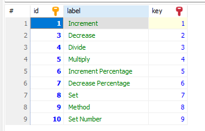

### Operations

These are saved on the database in the "operation_types" table and referenced by multiple models like "stats" or "rewards_modifiers".

The available operations are:
- Increment
- Decrease
- Divide
- Multiply
- Increment Percentage
- Decrease Percentage
- Set
- Method
- Set Number

The operation types can be referenced by "id" or by "key", normally by "key" since it should never change for the existent types:

