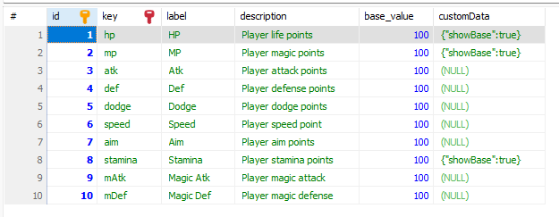

## Objects Importer

The objects importer can be used from the administration panel:


Or from the command line using Reldens NPX commands:
```
$ npx reldens-import objects [your-game-theme] [your-objects-data-file-path]
```
For example:
```
$ npx reldens-import objects custom-game-theme-test generate-data/objects.json
```

The way the importer works is with a JSON file that should contain the complete objects data but with some extra benefits, like:

- Having a "defaults" data set to avoid having to specify the same properties over and over if you have to create multiple objects.
- Getting almost all the related contents automatically created: animations, stats, experience rewarded and respawn areas.

**IMPORTANT NOTES**: 
- The importer will create all the objects related records, but you will have to manually upload the assets files to the proper folder `[your-theme-folder]/assets/custom/sprites/`.
- If you would like to get the "attributes per level" or the "experience rewards" automatically created you would need to pass that information to the importer, in which case, I recommend to use the [attributes per level generator](../generators/attributes-per-level.md) and the [enemies experience per level generator](../generators/enemies-experience-per-level.md).

```
{
    "objects": [
        {
            "clientKey": "enemy_forest_1",
            "title": "Tree",
            "privateParams": {
                "interactionRadio": 60
            },
            "clientParams": {
                "autoStart": true
            },
            "assets": [
                {
                    "assetType": "spritesheet",
                    "assetKey": "enemy_forest_1",
                    "assetFile": "monster-treant.png",
                    "extraParams": {
                        "frameWidth": 36,
                        "frameHeight": 34
                    }
                }
            ]
        },
        {
            "clientKey": "enemy_forest_2",
            "title": "Tree Punch",
            "privateParams": {
                "interactionRadio": 90
            },
            "assets": [
                {
                    "assetType": "spritesheet",
                    "assetKey": "enemy_forest_2",
                    "assetFile": "monster-golem2.png",
                    "extraParams": {
                        "frameWidth": 52,
                        "frameHeight": 32
                    }
                }
            ]
        }
    ],
    "defaults": {
        "classType": "multiple",
        "enabled": 1,
        "privateParams": {
            "shouldRespawn": true,
            "childObjectType": "enemy",
            "isAggressive": true
        },
        "animations": {
            "up": {
                "start": 9,
                "end": 11
            },
            "down": {
                "start": 0,
                "end": 2
            },
            "left": {
                "start": 3,
                "end": 5
            },
            "right": {
                "start": 6,
                "end": 8
            }
        },
        "respawn": {
            "respawnTime": 2000,
            "instancesLimit": 4
        },
        "roomsNames": [
            "objects-import"
        ]
    },
    "attributesPerLevelFile": "monsters-attributes-per-level-generated.json",
    "experiencePerLevelFile": "monsters-experience-per-level-generated.json"
}
```

The importer will loop over each "object" and create a data set that will clone the "defaults" to use these as base.
It will do a deep clone on the "defaults" and a deep merge on each property, meaning, if your "defaults" looks like this:
```
defaults: {
    property: {
        existentPropertyB
    }
}
```
And the current object has a value like:
`currentObject.property.subPropertyA = 'asdasd'`
This will override or be included a part of the existent `property` in the defaults, like:
```
defaults: {
    property: {
        existentPropertyB: 'qweqwe',
        subPropertyA: 'asdasd'
    }
}
```

In order to complete the objects creation we need to know the room ID for that object. 
Since manually writing the room IDs would be difficult and unclear to which room the object is going to be assigned, here we can use the `roomsNames`.
The importer will fetch the rooms IDs and create one `object` per each specified room here.
In the case above the 2 objects are going to be created in 3 rooms.

As you can see in the example above, we also need to know the `layer` (`layer_name` in the storage).
The specified layer is also used to create the respawn area for the object.

### Objects animations:
For now, Objects has 2 places where we need to define the animations:
- The "default" animation, which is defined in the `object.clientParams` and passed as part of the object properties.
- All the other animations defined by a name convention in the `animationKey` coming from the storage.

**IMPORTANT**: the `animationKey` convention follows the format `[layer-name]_[object-ID]_[key]`, where `key` is the part of the convention to set the animation `direction`.

For example, following the JSON above, you would get entries with the following keys for the first object:
```
ground-respawn-area-level-1_60_up
ground-respawn-area-level-1_60_down
ground-respawn-area-level-1_60_left
ground-respawn-area-level-1_60_right
```

### Objects "stats"

If your object is an "enemy" type, or for some reason it needs to have "stats", you can pass the "stats" information in two different ways:

- By passing the "stats" property on each object (or as part of the "defaults"), like the two samples below:
```
"objects": [
    {
        "clientKey": "enemy_forest_1",
        "title": "Tree",
        "privateParams": {
            "interactionRadio": 60
        },
        // ...
        "stats": {
            "hp": 100,
            "mp": 50,
            "atk":10,
            "def":10,
            // ...
        }
        // ...
    }
],
"defaults": {
    // ...
    "stats": {
        "hp": 100,
        "mp": 50,
        "atk":10,
        "def":10,
        // ...
    }
    // ...
}
```
In this case the format is `{[stat-key]: [stat-value]}`, where [stat-key] must match the `key` on the storage.



- By passing the path of the "[monster-attributes-per-level-generated.json](../examples/generated/monsters-attributes-per-level-generated.json)" file in the JSON, like:
```
"objects": [
    // ...
],
"defaults": {
    // ...
},
"attributesPerLevelFile": "/[path-to-file]/monsters-attributes-per-level-generated.json"
```

### Objects "experience" reward

The object experience reward can also be passed in two ways:
- As "experience" on each object (or as part of the "defaults"), like the two samples below:
```
"objects": [
    {
        "clientKey": "enemy_forest_1",
        "title": "Tree",
        "privateParams": {
            "interactionRadio": 60
        },
        // ...
        "experience": 10,
        // ...
    }
],
"defaults": {
    // ...
    "experience": 10,
    // ...
}
```

- By passing the path of the "[monsters-experience-per-level-generated.json](../examples/generated/monsters-experience-per-level-generated.json)" file in the JSON, like:
```
"objects": [
    // ...
],
"defaults": {
    // ...
},
"experiencePerLevelFile": "/[path-to-file]/monsters-experience-per-level-generated.json"
```
