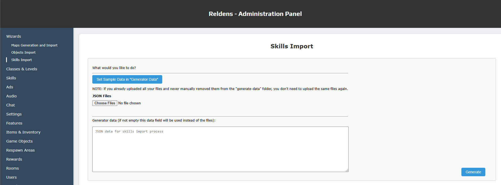

## Skills Importer

The skills importer can be used from the administration panel:


Or from the command line using Reldens NPX commands:
```
$ npx reldens-import skills [your-game-theme] [your-skills-data-file-path]
```
For example:
```
$ npx reldens-import skills custom-game-theme-test generate-data/skills.json
```

The way the importer works is with a JSON file that should contain the complete "skills" data.

Since the example is a bit complex you can check it in this link: [skills.json](../examples/generate-data/skills.json).

Following that file we will comment each section from top to bottom.

The first thing you will find is the importer options:
```
"options": {
    "removeAll": false,
    "override": false,
    "update": true
},
```

These refer to how the importer is going to behave according to the existent skills in the platform.
- "removeAll" will remove every existent skill and all it's related data before import the new ones.
- "override" will replace the existent skills by "key".
- "update" will actually upsert the new skills.

Then we have 2 main sections in the JSON: "defaults" and "skills".

The first set will be used as base and the importer will do a deep merge of the data coming from the "skills" overriding the values from "defaults".

The "defaults" in this importer come really handy since the "skills" have several related entities.

Let's first tackle the defaults for the "skill" entity itself:

```
"properties": {
    // ...
    "skillDelay": 1500,
    "castTime": 0,
    "usesLimit": 0,
    "range": 0,
    "rangeAutomaticValidation": 1
    // ...
},
```

Everything under properties will be merged as part of the [skill entity](../entities/skill.md) to be saved in the storage.

The next option is the "animations", here you can specify animations that could be used in multiple skills, or like in the example provide the default values for each "animation type".

The "animation types" are applied to each skill using the following name convention:

`[skill-key]_[animation-type]_[direction]`

For example:

`attackBullet_cast_up`

The available animation types are:
- "atk"
- "eff"
- "cast"
- "hit"
- "bullet"

And the directions are:
- "right"
- "left"
- "down"
- "up"

The application can be seen in the `playAttackOrEffectAnimation` and the `playHitAnimation` methods in the `lib/actions/client/receiver-wrapper.js` file.

In the importer you can specify the `appendSkillKeyOnAnimationImage` option, if you do, then you can set the "default" values for each animation type like in the example and then override the specific data for each skill animation.

For example, looking at the defaults "animations":
```
"defaults": {
    "animations": {
        "appendSkillKeyOnAnimationImage": true,
        "defaults": {
            "enabled": true,
            "type": "spritesheet",
            "frameWidth": 64,
            "frameHeight": 70,
            "start": 0
        },
        // ... 
        "cast": {
            "img": "_cast",
            "end": 3,
            "repeat": -1,
            "destroyTime": 2000,
            "depthByPlayer": "above"

        },
        "hit": {
            "img": "_hit",
            "end": 4,
            "repeat": 0,
            "depthByPlayer": "above"
        }
    },
}
// ...
```

When importing the "heal" example, you can see it has the following animations set:
```
"heal": {
    // ...
    "animations": {
        "cast": {},
        "hit": {}
    },
    // ...
```
Because "cast" and "hit" are declared here (empty object {} is used to base the animation entirely on the defaults), these will be merged into the defaults for "cast" data (same for "hit" data), then into the defaults for the "defaults" data returning the following result:
```
"animations": {
    "cast": {
        "enabled": true,
        "type": "spritesheet",
        "frameWidth": 64,
        "frameHeight": 70,
        "start": 0
        "img": "_cast",
        "end": 3,
        "repeat": -1,
        "destroyTime": 2000,
        "depthByPlayer": "above",
    },
    "hit": {
        "enabled": true,
        "type": "spritesheet",
        "frameWidth": 64,
        "frameHeight": 70,
        "start": 0,
        "img": "_hit",
        "end": 4,
        "repeat": 0,
        "depthByPlayer": "above"
    }
},
```
If we had something like this (note the enabled "false"):
```
"heal": {
    // ...
    "animations": {
        "cast": {"enabled": false},
        // ...
    },
    // ...
```
Then we would get:
```
"animations": {
    "cast": {
        "enabled": false,
        "type": "spritesheet",
        "frameWidth": 64,
        "frameHeight": 70,
        "start": 0
        "img": "_cast",
        "end": 3,
        "repeat": -1,
        "destroyTime": 2000,
        "depthByPlayer": "above",
    },
    // ...
```

The next set of default values are related to the "attack" skills type:

```
"attack": {
    // ...
    "affectedProperty": "stats/hp",
    "attackProperties": "stats/atk,stats/stamina,stats/speed",
    "defenseProperties": "stats/def,stats/stamina,stats/speed",
    "aimProperties": "stats/aim",
    "dodgeProperties": "stats/dodge",
    // ...
},
```

You can check the complete list of available fields in the storage table:


Normally for the ["attack" type](../entities/skill-types.md) skills you would have some specific properties affected and here you can avoid referencing those in every skill.

Then you will find the "physicalData" defaults, these are only required if you are creating a ["physical_attack" or "physical_effect"](../entities/skill-types.md) skill types:

```
"physicalData": {
    "validateTargetOnHit": 0
},
```

For those skill type you will normally have different speed, width and height on each skill, so the only useful parameter here is the validation one.

Then we have "targetEffects" and "ownerEffects", in both cases the required fields are the same:


The tricky part here is the "operationKey" which is called by "key", and that's a value set on the ["operation types" table](../general/operations.md).

- `[Know improvement]` - Include a constant string to properly reference these "operation keys".

Another thing to note here is that the properties keys requires the complete path to the property, for example:
```
stats/mp
statsBase/hp
```

This is because the property can be affected on their current value or on their "base" or "max" value.
For example, let's say we are creating an attack skill type that will reduce the current target HP in 10, we will use the `stats/hp`, in result the enemy HP will be like:
```
HP 90 / 100
```

But if the attack would actually damage the target permanently, then we could use the `statsBase/hp`, in which case the target HP will result like this:
```
HP 90 / 90
```

Additionally, here we could set the "ownerConditions", these are like the requirements to execute a skill (for example, you need 10 MP to cast a spell).

In the conditions you will find a field called "conditional", this field only accepts the specific values:
- `eq`, equals
- `ne`, not equals
- `lt`, lower than
- `gt`, greater than
- `le`, lower or equals than
- `ge`, greater or equals than

For last, we reached the "skills" data. Since we already specify most of the information in the defaults here we will find only the specifics for each skill.

They special available configurations you can find here are:
- "classPathLevelRelations": used to map the skill with a class path specific level by setting the class path "key" (like "mage": "1" or "warrior": "2" so the "mage" class path will get this skill at level 1 and the warrior at level 2), and if you use "all" then it will be applied to every class path at the same level.
- "objectsRelations": used to map the skill with many objects by setting the object "key" and the object ["target"](../entities/target-options.md) type, which would be normally the "player", like `"objectsRelations": {"enemy_1": "player", "enemy_2": "player"}`.
- "typeData": this will contain two sub-properties, the key to reference the skill type itself, and the specific skill type configurations.
- "clearPrevious": this property is mostly like helper for when you are updating or overriding a skill, is used to delete all the existent skill related entities ("targetEffects", "ownerEffects", "ownerConditions").
- then "targetEffects", "ownerEffects", "ownerConditions": different from the defaults, in this case these would an array of options since you can have multiple of each per skill (for example, a skill may require 20 MP and 5 stamina to be executed, or could reduce the target HP in 10 and the MP in 5).
