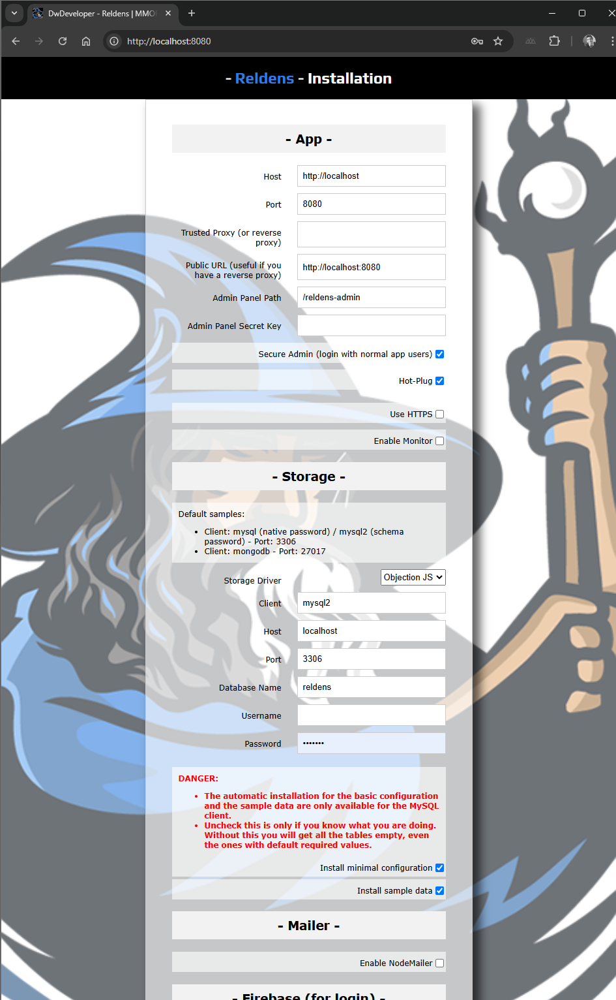

## Installation

[Check the software requirements here.](requirements.md)


This is an example "local" installation process, which can be done in two ways:

### - Through NPM / command line:

1 - Create a folder and run npm install reldens, like:
```
$ mkdir my-game
$ cd my-game
$ npm install reldens
```

2 - Create your game-app through the npx command:
```
$ npx reldens createApp my-game
```

3 - Run Node:
```
$ node .
```

4 - Browse the default URL http://localhost:8080/ to get the installation UI:



Here, you can easily configure the server services requirements.

**IMPORTANT: check the database considerations at the bottom of this page.**

Once you click on the "install" button, the installer will validate the parameters and import the database SQL scripts to create the tables and insert the required data (like the config or the sample data).


### - By GIT fork / clone the skeleton repository (not recommended but available):

https://github.com/damian-pastorini/reldens-skeleton/

1 - Git Clone: make sure you have the proper GitHub keys on your current user or just change the method to HTTPS clone to use your GitHub username/password.
```
$ git clone git@github.com:damian-pastorini/reldens-skeleton.git ./game
```

2 - Go into the folder:
```
$ cd ./game
```

3 - Run NPM installation:
```
$ npm install
```

4 - Login into your MySQL server, create a new database and import the 3 production files in the following order:
- https://github.com/damian-pastorini/reldens/blob/master/migrations/production/reldens-install-v4.0.0.sql
- https://github.com/damian-pastorini/reldens/blob/master/migrations/production/reldens-basic-config-v4.0.0.sql
- https://github.com/damian-pastorini/reldens/blob/master/migrations/production/reldens-sample-data-v4.0.0.sql

5 - Create or update the `.env` and `knexfile.js` with your server credentials.

**IMPORTANT: check the database considerations at the bottom of this page.**

At this point you could change your database client by setting `mysql` or `mysql2` as your RELDENS_DB_CLIENT environment variable depending on your MySQL server version. 

7 - Run Node:
```
$ node .
```

8 - Browse the default URL http://localhost:8080/ and the game should run normally.

IMPORTANT: if you remove the `install.lock` file from the root folder, and re-run the process (`node .`), you will get the installation guide that will help you to install Reldens.


### Changing environment variables:

For example for the log level:

```
// linux, gitbash:
$ RELDENS_LOG_LEVEL=9 node .

// windows cmd or powershell:
$ set RELDENS_LOG_LEVEL=9 && node .
```

### Help commands:

Now you can use npx commands.

Reminder: replace `[your-theme-name]` by your game theme name, in this installation example the theme name is `my-game`.

These are the basic commands you will need to re-install or rebuild your client:
```
$ npx reldens help
$ npx reldens installSkeleton [your-theme-name]
$ npx reldens buildCss [your-theme-name]
$ npx reldens buildClient [your-theme-name]
$ npx reldens copyAssetsToDist [your-theme-name]
```

### You are done!

Now, you should be able to browse the default following links:

Game: http://localhost:8080/

Administration Panel: http://localhost:8080/reldens-admin

By default, only the `root` registered user is an administrator.

The admin role ID can be changed by setting the default "admin/roleId" in the "config" table in the database.
```sql
UPDATE `config` SET `value` = [new-admin-role-id] WHERE `scope` = 'server' AND `path` = 'admin/roleId';
```

### Client distribution and dist folder:

You can deploy the game in a server and have the client deployed on any CDN.

- The first step will be to have the server installed anywhere. You have many options for this, from any normal cloud service (like an AWS EC2 instance to the Colyseus Cloud). I'm not really going to dig deep in here since how do you architecture your server is not strictly related to this process.
- On your local environment you need to edit the SERVER_URL variable on the game client.
- Build the client and get the contents of the "dist" folder.
- Upload those contents to any CDN.

ENJOY!

---

### IMPORTANT Database considerations

- Make sure to use `mysql` or `mysql2` depending on your MySQL server version (`mysql` will require the old native authentication, it's recommended to use `mysql2`).
- If you had installed Reldens in the past, and you are planning to use the same database, neither the installer nor the migration scripts will remove any existent tables, and those won't be updated as probably required, so make sure to use an empty database.

