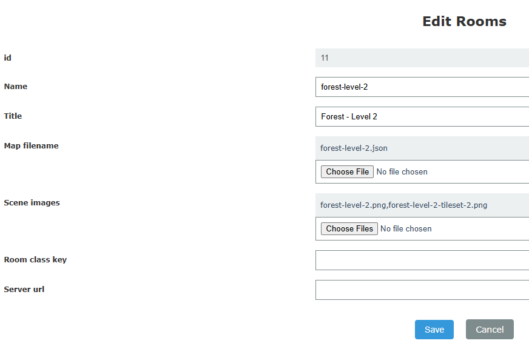
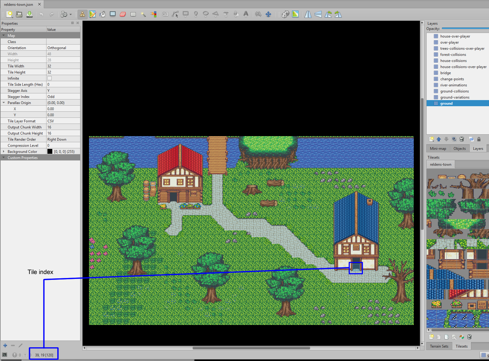
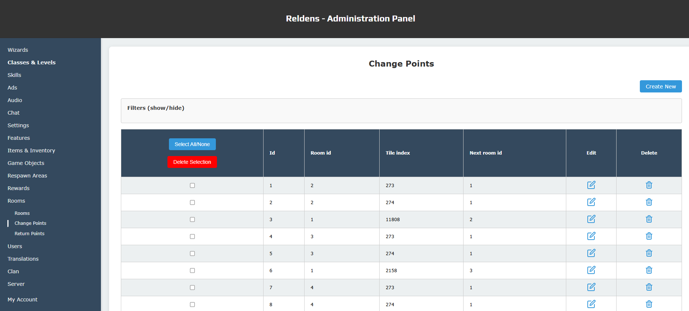
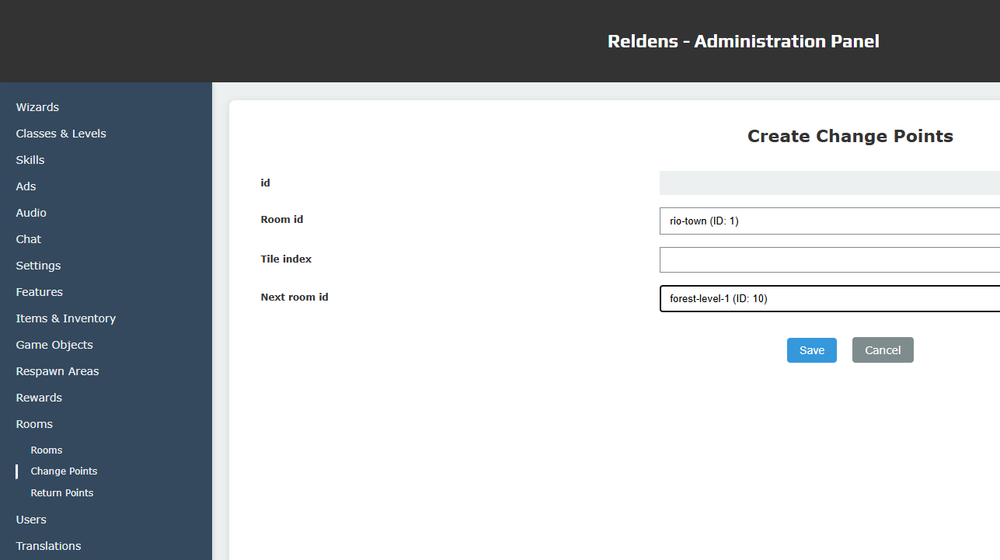

## How to create a new Room/Scene?

This section will describe all the tools and the process to create a new Scene from scratch.

---

### Recommended tools

- Tiled Map Editor: https://www.mapeditor.org
- Tiled Map Optimizer: https://www.reldens.com/tiled-map-optimizer/
- Tile Map Generator: https://www.reldens.com/documentation/tile-map-generator > https://github.com/damian-pastorini/tile-map-generator/
- Frame Extruder: https://github.com/lgibson02/FrameExtruder

---

### Create the map

Open the Tiled Map Editor app and create a new map with a fixed size (for example 30 x 30).

The most IMPORTANT considerations here are:

- "How you split the map layers": since this will affect if the layers go over or below the player sprint.
- "The map layers name conventions": this way Reldens will identify which layers are used for the collisions, the scene change-points, the return points, the respawn areas, and every other map behavior like how the layers will be displayed according to the player. For last, the layers name conventions are used for both server and client sides.

Layers name conventions:

#### "collisions"

Any layer with this keyword in the name will be used to create blocks used for collisions in the server side. A collision in the server side will be represented by a empty box with the size of a tile, so if you edit your map and hit/collide with an empty space, is probably because you have a tile with a value different from zero in that position in a layer with the word "collisions" on the name.

To avoid this kind of issues I recommend you to use the TiledMap option to "Highlight Current Layer" (available pressing H while editing the map), this way you will easily see if there's any non-empty blocks in any "collision" layer.

#### "over-player"
Any layer with this keyword in the name will get an incremental depth in the client side, this way the map view will be affected by the layers order in the file and by the layers name that will get the incremental depth, so even when you can see the layers properly displayed in the TiledMap editor you may not get the exact same result after we process the layers to all these over the player.

For example: if you have 5 layers, and the 3rd and 5th in the list have "over-player" in the name, the layers will get the following depth in Phaser: L1 = depth 0, L2 = depth 0, L3 = depth 1, L4 = depth 0, L5 = depth 2 > where the player sprite will have depth 0 and go over all the other layers, the L3 and 5 will be over the player.

The layer deep will be calculated like: layer index * map.height * map.tileHeight.

#### "change-points"
Any layer with this in the name should only have tiles are going to be used as change-points in the server side.

At this time if you used multiple images to create your maps, you will need to merge them in one, for that you can check optimize steps below.

#### "respawn-area"
The layers contain this keyword in the name, the layer will be used for the related respawn object areas and every tile different from `0` in this layer will be used for respawn objects. 

Note: when creating these respawn areas you don't need to worry about the "non-walkable" tiles since Reldens will filter those when the respawn area is created, meaning you could set a fully occupied layer as your tile map base and still get objects only respawning in the "free" tiles. 

#### "below-player"

---

### Add multiple tilesets to the same map

If your map has more than one tileset you need to include multiple scene images and each tileset name in the `JSON` must have the same name as the image without the file extension.

First you need to edit you `room` and upload multiple images for the "Scene Images", for example:



Then edit your map `JSON` file, search for the "tilesets", and fix their names after their image file names like:

```
"image":"reldens-forest.png",
"name":"reldens-forest",
```

```
// ... 
"tilesets": [
    {
        "columns":14,
        "firstgid":1,
        "image":"reldens-forest.png",
        "imageheight":408,
        "imagewidth":476,
        "margin":1,
        "name":"reldens-forest",
        "spacing":2,
        "tilecount":168,
        "tileheight":32
    }
// ...
```

- `[Know bug v4.0.0-beta.38.3]` - Multiple images here is breaking because all the tilesets are been included with the same key and the tileset key must be unique.

---

### Manually create new change points

The change points are saved only in the storage (for now), and to create them you need to know the tile-index where it was specified in the map file.

How to get the index?

If you are using Tiled it will give to you the tile coordinates let's say "39,19" (x,y) in a "48x28" tiles map like below:



`39,19` is the door on the blue house, with that information you can do the calculation:

`tileIndex = y * mapW + x` > `19 * 48 + 39`

And you will get the `index = 951`, which is the required value for our change-point.

In the administration panel, go to the Rooms / Change Points section:



Click on "Create New" button and complete the form with the origin room, the tile index you just calculate and the destination room:



Click on "Save" and you are done, when the player hit that point it will be automatically sent to the next room.

---

### Manually create new return positions

What is a return point? Basically, the initial scene position that depends on the previous scene.

For example: you are in the town > go to the first house > this one only has 1 return point saved (since your are always coming from a single door in the town) > but when you move out from the house 1, you will need to specified at which point of the town the player is going to be displayed, so there you will see two return positions for the town in the database: one is the default that will be always the house 1, and the other will be for the house two.

To create these return positions you need to specify:

- The position in pixels

- If it's the "default" position of that scene or not

- And the scene where that position will be trigger

A record in this table will look like this:

INSERT INTO `rooms_return_points` (`id`, `room_id`, `direction`, `x`, `y`, `is_default`, `from_room_id`) VALUES (9, 6, 'right', 400, 400, 0, 2);

The "room_id" is where the player will be after the room change. If you go from the town into the house 1 this room_id will be the room_id of the house 1.
The "direction", is how the player will be displayed (looking up, down, left or right).
The "x" and "y" values are the position in pixels where the player will be displayed in the map (here will be the position in the house 1)
For last, the "from_room_id" is where the player is coming from (the town room ID).
