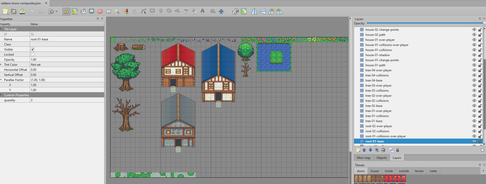
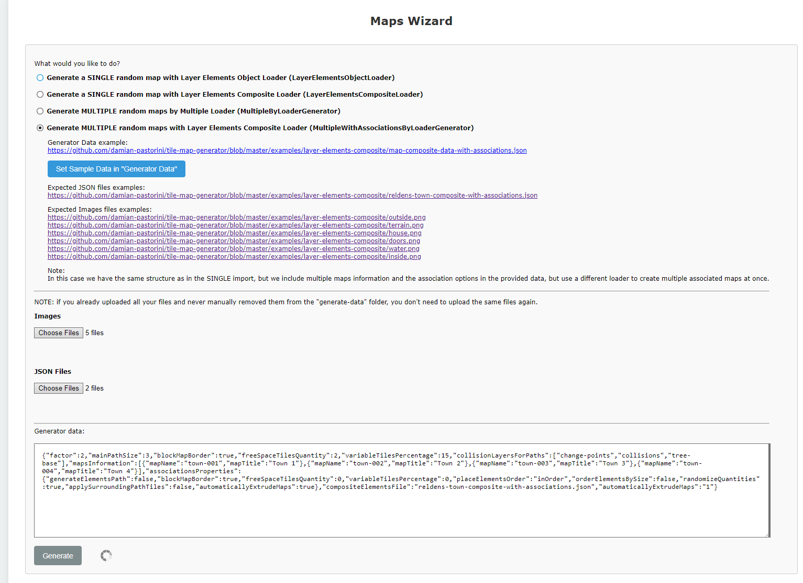
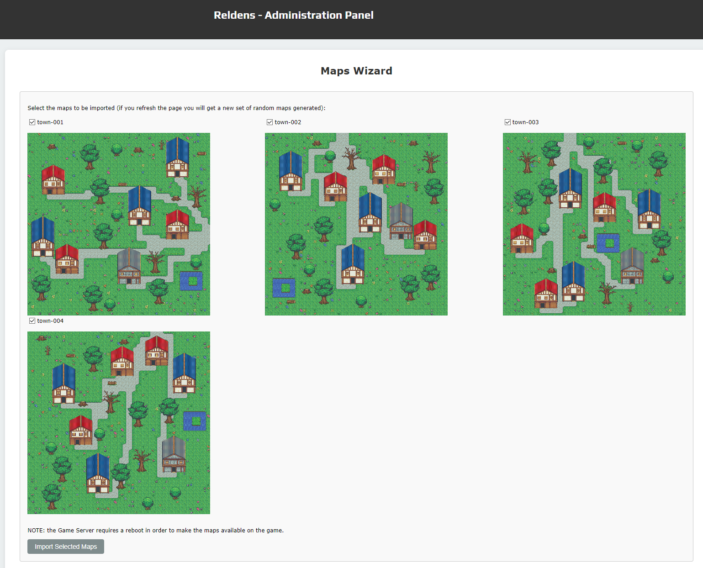

## Maps Wizard

In the admin panel you will find the Maps Wizard, which will help you to generate and import your maps at once.

Go to the administration panel > Wizards > Maps Generation and Import

### 1 - Generate the map(s)

The wizard has 4 main options to create maps from different types of files.

IMPORTANT: maps layers name conventions MUST BE FOLLOWED IN EVERY CASE.

Note: for glossary purpose I will use "TME" when referring to the "Tiled Map Editor" app. 

Here you can find a brief description of each option and links to their full documentation:

1. ["Generate a SINGLE random map with Layer Elements Object Loader (LayerElementsObjectLoader)"](generators/maps-single-layer-elements-object-loader.md):
   - For this option you will need to create a single map JSON file with "TME" for each element on your scene.
   - Then, on your "Generator data" (between the other requirements), you will need to specify how many of each element the generator has to create.
   - With that the generator will create a map with those elements placed randomly.


2. ["Generate a SINGLE random map with Layer Elements Composite Loader (LayerElementsCompositeLoader)"](generators/maps-single-layer-elements-composite-loader.md):
    - In this case you will need to create a single map JSON file containing all the elements to be used for the creation.
    - The important part here is the quantity must be specified as custom property in each "base" layer for each element.



3. ["Generate MULTIPLE random maps by Multiple Loader (MultipleByLoaderGenerator)"](generators/maps-multiple-multiple-by-loader-generator.md):
    - The only difference between this option and the previous is that we can pass a set of "mapNames" on the "Generator data", and the generator will create multiple random maps for each name.

4. ["Generate MULTIPLE random maps with Layer Elements Composite Loader (MultipleWithAssociationsByLoaderGenerator)"](generators/maps-multiple-multiple-with-associations-by-loader-generator.md):
    - For the last option, we will need to pass same data as previous option, but include the sub-maps that will be associated to the main ones.
    - For example, if we pass 2 town maps as main ones (through mapsNames), with one associated house map with quantity 5, the generator will create 2 towns (linked by the path layer), with 5 houses each, where each door will be linked to the house inner map. Yes! This will give you a complete town.

To show the simple way to create tons of maps at once we will choose option #4.

Follow the guide liked in the item above to create your own map files, for the documentation we will use the provided files by reldens examples.

First click on the `Set Sample Data in "Generator Data"` button.

That will complete the textarea below with the following information (don't use the code below since it's the parameters explanation):

```json
{
    "factor": this is the value used to increase / decrease the map images size, for example if your map is 16x16 but you want to use 32x32 you can set a "2" here). 
    "mainPathSize": the main path size is the amount of tiles used to start the map in the borders.
    "blockMapBorder": this would make the map border tiles walkeable or not.
    "freeSpaceTilesQuantity": the amount of tiles between the map elements.
    "variableTilesPercentage": the percentaje of the total map that will be used to place random ground tiles fron the specified variations.
    "collisionLayersForPaths": an array of layers that will not allow the generator to create the path over.
    "mapsInformation": [ // an array of maps to be generated
        {
            "mapName": "town-001", // the map name is going to be used as key
            "mapTitle": "Town 1" // the label will be used for the later import 
        },
        // create as many as you need
    ],
    "associationsProperties": { // these are the properties applied to the sub-maps
        "generateElementsPath": this will avoid the path creation inside the sub-maps
        "blockMapBorder": true,
        "freeSpaceTilesQuantity": 0,
        "variableTilesPercentage": 0,
        "placeElementsOrder": default is "random", but "inOrder" will make the generator place one element after the other in the map.
        "orderElementsBySize": false,
        "randomizeQuantities": this will randomize the entire elements array, for example 2 houses, 2 trees, could get 1 tree, 2 houses, 1 tree, or house, tree, house, tree, etc.  
        "applySurroundingPathTiles": true by default this will make the genearator look for the path corners tiles and apply those to the main path, this way you can get paths with rounder corners.
        "automaticallyExtrudeMaps": true by default, this will prevent tile bleeding issues.
    },
    "compositeElementsFile": this is a reference to the uploaded JSON file used for the sub-maps data. 
    "automaticallyExtrudeMaps": this is to prevent tile bleeding issues on the main maps
}
```

Now, you can download the following files to attach on your generator (these links are also visible in the admin when you choose the option):

Expected JSON files examples:
- https://github.com/damian-pastorini/tile-map-generator/blob/master/examples/layer-elements-composite/reldens-town-composite-with-associations.json

Expected Images files examples:
- https://github.com/damian-pastorini/tile-map-generator/blob/master/examples/layer-elements-composite/outside.png
- https://github.com/damian-pastorini/tile-map-generator/blob/master/examples/layer-elements-composite/terrain.png
- https://github.com/damian-pastorini/tile-map-generator/blob/master/examples/layer-elements-composite/house.png
- https://github.com/damian-pastorini/tile-map-generator/blob/master/examples/layer-elements-composite/doors.png
- https://github.com/damian-pastorini/tile-map-generator/blob/master/examples/layer-elements-composite/water.png
- https://github.com/damian-pastorini/tile-map-generator/blob/master/examples/layer-elements-composite/inside.png

Select the files in the file-inputs in the admin:



Click on the `"Generate"` button, the admin will ask if you are sure, click ok "OK".

Depending on how many maps you set for the generation the process may take a while.

The next screen will show you the generated main maps:



Known missing feature: here we will display the sub-maps as well

Mark the ones you consider "ok" to import, and click on the `"Import generated maps"` button.

You will get back to the maps wizard page with a success message on it.
