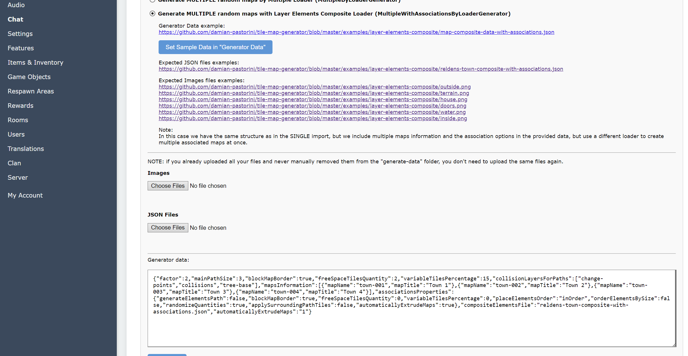

## Maps Wizard

In the admin panel you will find the Maps Wizard, which will help you to generate and import your maps at once.

The wizard is built over the `@reldens/tile-map-generator` package ([check the documentation here](packages/tile-map-generator/index.md)), which can be used as standalone by creating your own scripts to generate maps.

Go to the administration panel > Wizards > Maps Generation and Import

The wizard has 4 main options to create maps from different types of files.

**IMPORTANT NOTES:**
- Maps layers name conventions MUST BE FOLLOWED IN EVERY CASE ([check the maps manual creation section](maps-manual-creation.md)).
- I strongly recommend to learn how to use the Tiled Map Editor app (https://www.mapeditor.org), knowing how to edit tilesets, export maps and create terrains (https://doc.mapeditor.org/en/stable/manual/terrain/) for the maps edition are the most useful features. 

Note: for glossary purpose I will use "TME" when referring to the "Tiled Map Editor" app. 

Here you can find a brief description of each option and links to their full documentation:

1. ["Generate a SINGLE random map with Layer Elements Object Loader (LayerElementsObjectLoader)"](generators/maps-single-elements-object-loader.md):
   - For this option you will need to create a single map JSON file with "TME" for each element on your scene.
   - Then, on your "Generator data" (between the other requirements), you will need to specify how many of each element the generator has to create.
   - With that the generator will create a map with those elements placed randomly.

2. ["Generate a SINGLE random map with Layer Elements Composite Loader (LayerElementsCompositeLoader)"](generators/maps-single-elements-composite-loader.md):
    - In this case you will need to create a single map JSON file containing all the elements to be used for the creation.
    - The important part here is the quantity must be specified as custom property in each "base" layer for each element.

3. ["Generate MULTIPLE random maps by Multiple Loader (MultipleByLoaderGenerator)"](generators/maps-multiple-by-loader-generator.md):
    - The only difference between this option and the previous is that we can pass a set of "mapNames" on the "Generator data", and the generator will create multiple random maps for each name.

4. ["Generate MULTIPLE random maps with Layer Elements Composite Loader (MultipleWithAssociationsByLoaderGenerator)"](generators/maps-multiple-with-associations-by-loader-generator.md):
    - For the last option, we will need to pass same data as previous option, but include the sub-maps that will be associated to the main ones.
    - For example, if we pass 2 town maps as main ones (through mapsNames), with one associated house map with quantity 5, the generator will create 2 towns (linked by the path layer), with 5 houses each, where each door will be linked to the house inner map. Yes! This will give you a complete town.

To show the simple way to create tons of maps at once we will choose option #4 (here I'm only describing the steps, for deeper understanding how it works check each option section).

For these quick steps we will use the sample files provided by Reldens.

First click on the `Set Sample Data in "Generator Data"` button, which will complete the textarea below with the required parameters to generate the maps:

Now, you can download the following files to attach on your generator (these links are also visible in the admin when you choose the option):

Expected JSON files examples:
- https://github.com/damian-pastorini/tile-map-generator/blob/master/examples/layer-elements-composite/reldens-town-composite-with-associations.json

Expected Images files examples:
- https://github.com/damian-pastorini/tile-map-generator/blob/master/examples/layer-elements-composite/outside.png
- https://github.com/damian-pastorini/tile-map-generator/blob/master/examples/layer-elements-composite/terrain.png
- https://github.com/damian-pastorini/tile-map-generator/blob/master/examples/layer-elements-composite/house.png
- https://github.com/damian-pastorini/tile-map-generator/blob/master/examples/layer-elements-composite/doors.png
- https://github.com/damian-pastorini/tile-map-generator/blob/master/examples/layer-elements-composite/water.png
- https://github.com/damian-pastorini/tile-map-generator/blob/master/examples/layer-elements-composite/inside.png

Select the files in the file-inputs in the admin:

Click on the `"Generate"` button, the admin will ask if you are sure, click ok "OK".

Depending on how many maps you set for the generation the process may take a while.

The next screen will show you the generated main maps:

Known missing feature: here we will display the sub-maps as well.

Mark the ones you consider "ok" to import, and click on the `"Import generated maps"` button.

You will get back to the maps wizard page with a success message on it.

If you had sub-maps created (like in the example above), the sub-maps will be automatically created and associated to the main map, but, all the main maps are not associated by default so you will need to [edit and create change and return points between those](../).
