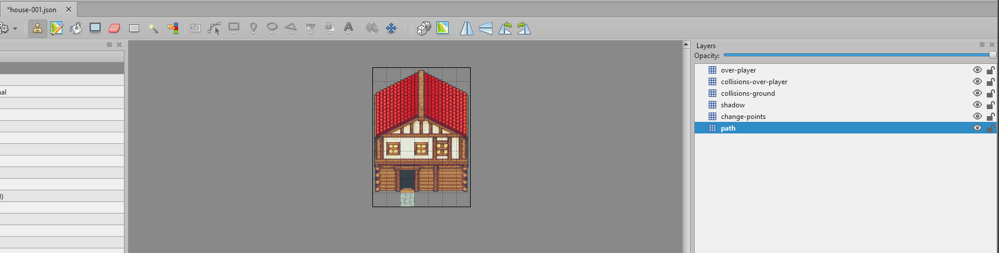

## Maps Wizard

In the admin panel you will find the Maps Wizard, which will help you to generate and import your maps at once.

Go to the administration panel > Wizards > Maps Generation and Import

### 1 - Generate the map(s)

The wizard has 4 main options to create maps from different types of files.

IMPORTANT: maps layers name conventions MUST BE FOLLOWED IN EVERY CASE.

Note: for glossary purpose I will use "TME" when referring to the "Tiled Map Editor" app. 

Here you can find a brief description of each option and links to their full documentation:

1. ["Generate a SINGLE random map with Layer Elements Object Loader (LayerElementsObjectLoader)"](generators/maps-single-layer-elements-object-loader.md):
   - For this option you will need to create a single map JSON file with "TME" for each element on your scene.
   - Then, on your "Generator data" (between the other requirements), you will need to specify how many of each element the generator has to create.
   - With that the generator will create a map with those elements placed randomly.

2. ["Generate a SINGLE random map with Layer Elements Composite Loader (LayerElementsCompositeLoader)"](generators/maps-single-layer-elements-composite-loader.md):
    - In this case you will need to create a single map JSON file containing all the elements to be used for the creation.
    - The important part here is the quantity must be specified as custom property in each "base" layer for each element.

3. ["Generate MULTIPLE random maps by Multiple Loader (MultipleByLoaderGenerator)"](generators/maps-multiple-multiple-by-loader-generator.md):
    - The only difference between this option and the previous is that we can pass a set of "mapNames" on the "Generator data", and the generator will create multiple random maps for each name.

4. ["Generate MULTIPLE random maps with Layer Elements Composite Loader (MultipleWithAssociationsByLoaderGenerator)"](generators/maps-multiple-multiple-with-associations-by-loader-generator.md):
    - For the last option, we will need to pass same data as previous option, but include the sub-maps that will be associated to the main ones.
    - For example, if we pass 2 town maps as main ones (through mapsNames), with one associated house map with quantity 5, the generator will create 2 towns (linked by the path layer), with 5 houses each, where each door will be linked to the house inner map. Yes! This will give you a complete town.

To show the simple way to create tons of maps we will choose option #4.
