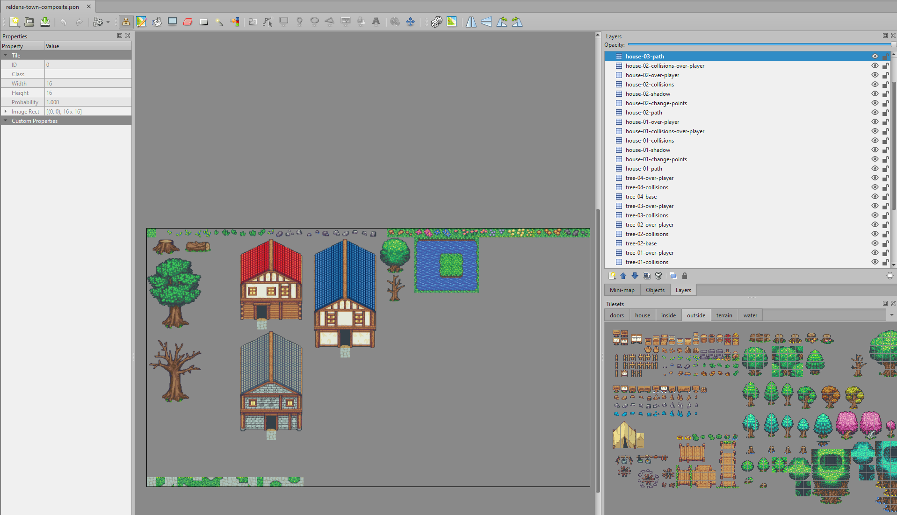
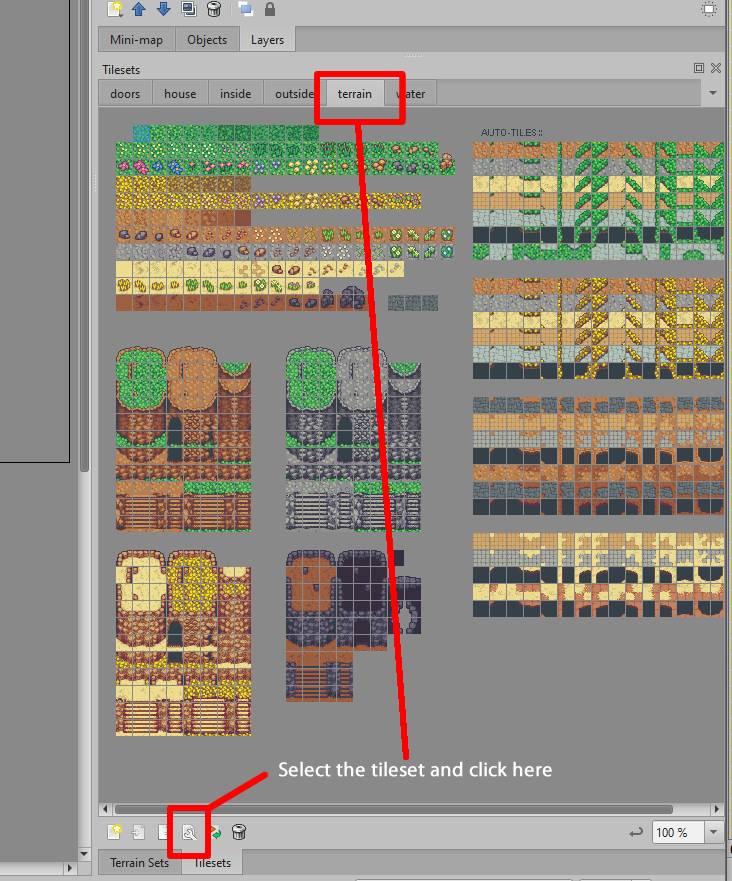
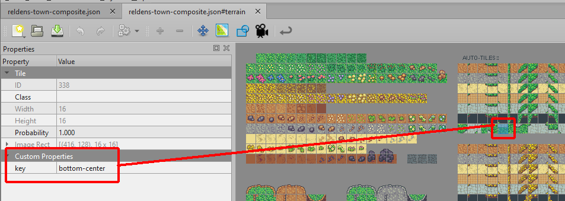
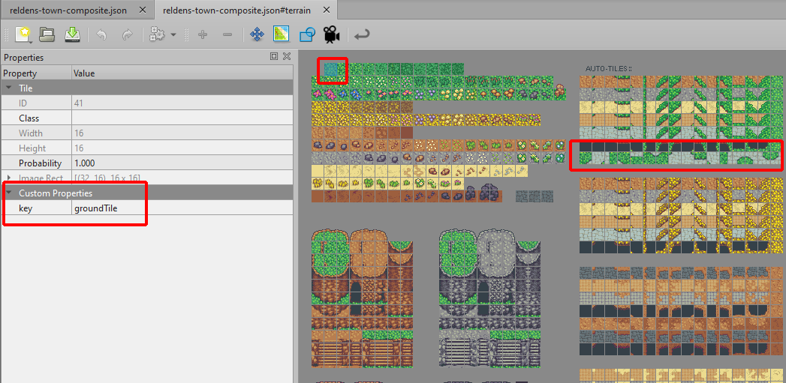
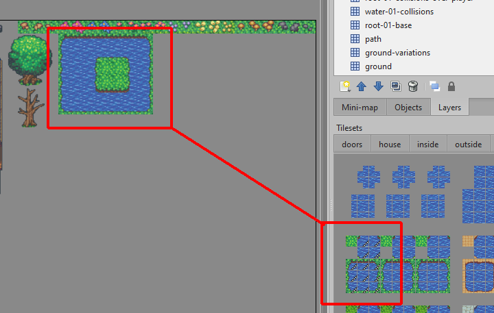
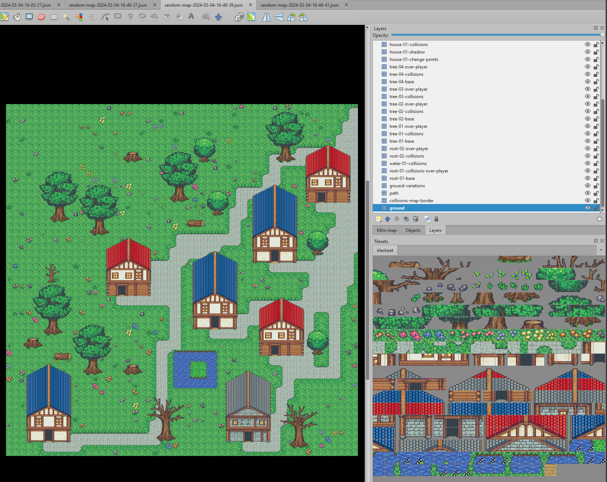
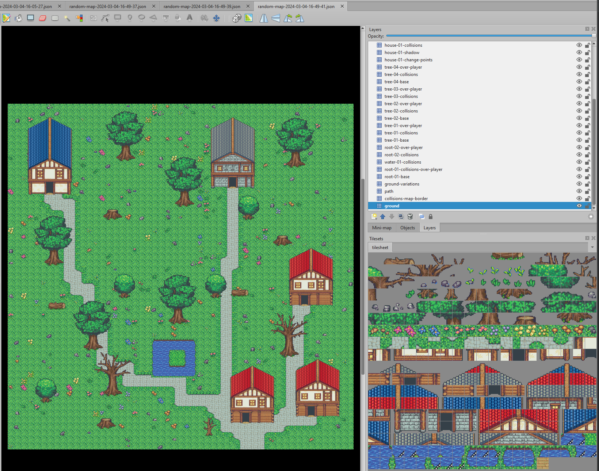
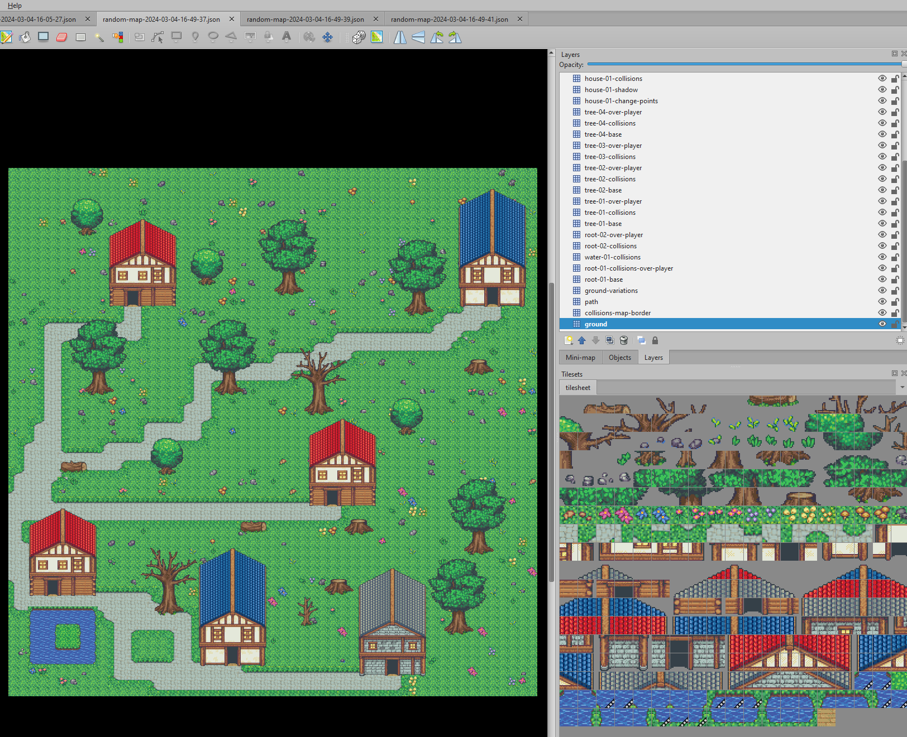
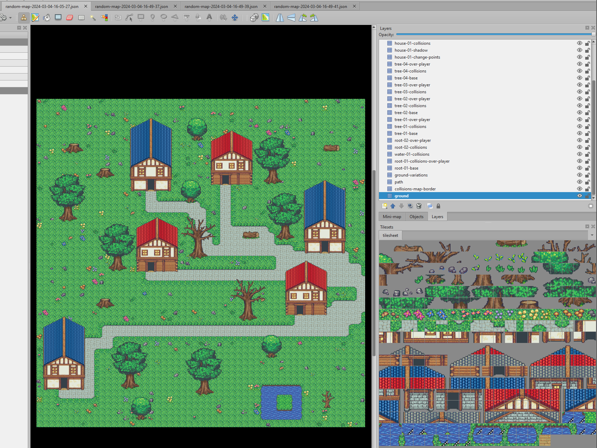

# The "composite" approach

Here, the simple part is the script, most of the required information (like tiles and so) will be taken from the map file itself, so let's see how it looks like:

```js
const { ElementsProvider } = require('@reldens/tile-map-generator/lib/generator/elements-provider');
const { RandomMapGenerator} = require('@reldens/tile-map-generator');
const map = require('./reldens-town-composite.json');
const rootFolder = __dirname;

const execute = async () => {
    let elementsProvider = new ElementsProvider({map, rootFolder, factor: 1});
    await elementsProvider.splitElements();
    let optimizedMap = elementsProvider.optimizedMap;
    let optimizedTileset = optimizedMap.tilesets[0];
    let mapData = {
        rootFolder,
        tileSize: optimizedMap.tilewidth,
        tileSheetPath: elementsProvider.fileHandler.joinPaths('generated', optimizedTileset.image),
        tileSheetName: optimizedTileset.image,
        imageHeight: optimizedTileset.imageheight,
        imageWidth: optimizedTileset.imagewidth,
        tileCount: optimizedTileset.tilecount,
        columns: optimizedTileset.columns,
        margin: optimizedTileset.margin,
        spacing: optimizedTileset.spacing,
        tiles: optimizedTileset.tiles,
        layerElements: elementsProvider.croppedElements,
        elementsQuantity: elementsProvider.elementsQuantity,
        groundTile: elementsProvider.groundTile,
        mainPathSize: 3,
        blockMapBorder: true,
        freeSpaceTilesQuantity: 2,
        variableTilesPercentage: 15,
        pathTile: elementsProvider.pathTile,
        collisionLayersForPaths: ['change-points', 'collisions', 'tree-base'],
        randomGroundTiles: elementsProvider.randomGroundTiles,
        surroundingTiles: elementsProvider.surroundingTiles,
        corners: elementsProvider.corners
    };
    const generator = new RandomMapGenerator(mapData);
    generator.generate();
};

execute();
```

The `ElementsProvider` is a helper class that will read the map file to get all the required data from the tiles custom properties, then will optimize the map (to merge all the tile sets into a single file for the random map), it can scale it if you need (Note: actually you need to set the factor: 1 to avoid the scale, I will fix this soon), and will give you a result ready to be used on the map-generator.

What won't be provided by the "ElementsProvider"?

- mainPathSize: this is where the paths to the elements will start, and the size is the amounts of tiles the path is going to ocuppy on the map border.
- blockMapBorder: is to prevent any elements from been place in any borders, and it will also generate a "collisions" layer to prevent the players from reach the border (Note: this will be configurable soon).
- freeSpaceTilesQuantity: the map size will be calculated from the total of elements provided multiplied by each element area, this parameter is the amount of tiles that will be added additionally to map size as free space (disregarding how the elements are placed in the map).
- variableTilesPercentage: this is the proportion of the free space in the map, that will get a randomized tile from the groundVariations.



Back on Tiled! In the image above you can see the example for the composite map-file.
This file use multiple "tilesets", but not all the tiles are been used in the composite.
Also, the tile size is 16x16, and we want to have 32x32 tiles.
For these changes is where the Tile Map Optimizer kicks in: as first step of the "ElementsProvider" it will generate an instance of the TileMapOptimizer, which will scrap only the used tiles from each tileset, generate a new image, and create a copy of the map to update the JSON tile indexes references.
At the same time if the "factor" was specified (in our case factor = 2, for 16x16 > 32x32), it will resize the image.

Now let's look at the required conventions, starting for the layers names:
- "ground", this must contain a single tile which will be used as base ground.
- "ground-variations", this should contain all the tiles that can be used for the ground variations.
- "path", this layer must contain all the layers related to the path, not only the path base but also the surrouding tiles and the corners if required.

These 3 are special names used by the tool.

The last rule is to split the layers name in minimum 3 parts by a score "-":
```
[element-key]-[element-number-reference]-[any-other-required-convention-or-custom-name]
```





The next step is to edit each tileset:

- Select the used tiles and include a custom property called "key" on each tile related to the required value: "groundTile", "pathTile", each surrounding (top-left, top-center, top-right, middle-lef, middle-right, bottom-left, bottom-center, bottom-right), and each corner tiles (corner-top-left, corner-top-right, corner-bottom-left, corner-bottom-right).

This way you don't need to manually figure it out each tile index, but the generator will get the index by searching on these marked tiles by the property called "key".



Note: if your "tilesets" have any animations, these will be ported automatically by the Tile Optimizer.

Map elements quantity
For last, in the first layer of each element, you need to include the "quantity" property.

Just pick the layer, and click "Add new property" (type "int"), and the value should be the amount of that element that you may want on the map.

And that's pretty much it! Throw your files in a folder with the script and run it as many times you need to generate different maps!





