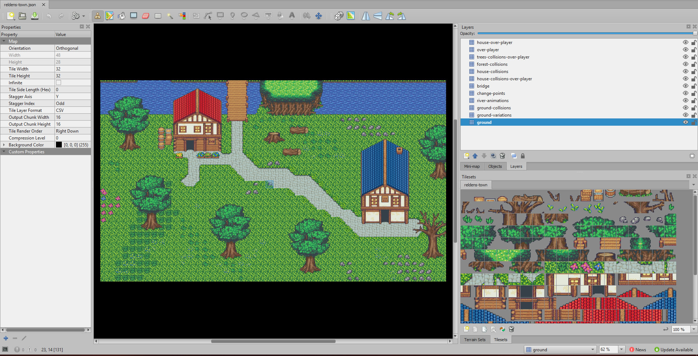

# Tile Map Generator

This tool was designed to help users to easily create tons of random tile maps for their games.

In order to use this, you will need to create a small script to provide the data and then run it through NodeJS.

You can find the tool on GitHub or just install it through NPM:

- GitHub: https://github.com/damian-pastorini/tile-map-generator/

- NPM: https://www.npmjs.com/package/@reldens/tile-map-generator

```
$ npm install @reldens/tile-map-generator
```

Once you install it, you can use the tool in two ways:

- Generating files for each element to be passed to the map generator:

https://github.com/damian-pastorini/tile-map-generator/tree/master/examples/layer-elements-object

- Generating a single file with all the contents and setting everything on the tile map:

https://github.com/damian-pastorini/tile-map-generator/tree/master/examples/layer-elements-composite

Note: make sure to have a "generated" folder created previously to start generating the maps (I will fix this in the following versions).

First let's have a summary on how the generator itself works:

- You need to provide the map data, most of these fields are the same provided in any Tiled-Map JSON file under the "tileset" property, but some with small changes:
```
"columns":52, // same
"image":"outside.png", // tileSheetName
"imageheight":384, // imageHeight
"imagewidth":832, // imageWidth
"margin":0, // same
"spacing":0, // same
"tilecount":1248, // tileCount
"tileheight":16, // tileSize
"tilewidth":16, // tileSize
```

And some new:
```
tileSheetPath: '/full-path-to-the-tileSheetName',
layerElements: {element1JSON, element2JSON}, // this is the array of map elements that will be used to randomly create the map
elementsQuantity: {element1JSON: 2, element2JSON: 7}, // this is the quantity that should be placed for each element on the map
groundTile: 116, // the tile index for the ground
mainPathSize: 3, // the amount of tiles used for the paths starting point
blockMapBorder: true, // is to prevent any elements from been place in any borders, and block the players from reach the border
freeSpaceTilesQuantity: 3, // the amount of tiles that will be added additionally to map size as free space
variableTilesPercentage: 22, // this is the proportion of the free space in the map that will get a randomized randomGroundTiles
pathTile: 121, // the tile used to create the paths
collisionLayersForPaths: ['change-points', 'collisions', 'tree-base'], // the layers that should block the tiles for the paths
randomGroundTiles: [23,28,29], // the tile indexes used for the variableTilesPercentage
surroundingTiles: { // this are the tile indexes used for the path borders
    '-1,-1': 127, // 294, // top-left
    '-1,0': 124, // 295, // top-center
    '-1,1': 130, // 296, // top-right
    '0,-1': 126, // 293, // middle-left
    '0,1': 129, // 289, // middle-right
    '1,-1': 132, // 292, // bottom-left
    '1,0': 131, // 291, // bottom-center
    '1,1': 133, // 290, // bottom-right
},
corners: { // this are the tile indexes used for the path corners
    '-1,-1': 285, // 294, // top-left
    '-1,1': 284, // 296, // top-right
    '1,-1': 283, // 292, // bottom-left
    '1,1': 282, // 290, // bottom-right
}
```

When the process starts the map size will be calculated based on the area for the total elements to be placed + the specified free space, for example:

- element 1: 2x2 tiles, quantity 2
- element 2: 3x3 tiles, quantity 1
- freeSpaceTilesQuantity = 2

The map will get the size putting the first 2 elements in the same row, the next element in the second row, and then will add the free space, this will give us:

- 4 tiles width for the elements on the first row by 2 tiles height > map size 4x2
- for the next row it already has space enough for the 3 tiles width, so it will only add 3 tiles more to the height > updated map size 4x5
- then add the free space of 2 tiles > updated map size 6x7

The elements will be placed randomly without colliding each other.

After calculate the map size and placed the elements, it will search for each element with a path layer and the single tile marked with the "pathTile".

With this information it will generate paths from the main path starting point (randomly placed in the map borders using the mainPathSize), to each element pathTile.

In order to get the layer elements we need to create the contents by following some conventions and setting the configurations required for the randomize process (like how many of each element, paths, ground variations, etc.).



Let's open Tiled (https://www.mapeditor.org/), and check how a normal map for Reldens looks like (see the image above is from the default sample theme).

As you can see, [the layers naming is following the conventions](maps-manual-creation.md), in summary:

- "collisions" is used for everything that will collide with the player or enemies.
- "over-player" is used to make the entire layer always be displayed over the player.
- "change-points" is used to define where the room will send the player to another room.
- "respawn-area" is used to define where specific objects will respawn after defeat.

Obviously "collisions" and "over-player" can be combined so you can get the player collide with bodies that could be below the current tile without need to define the same tile twice.

Additionally, for the randomize process you will need an extra convention:

- "path" which is used to place the points where the elements will be connected to the paths in the random map (this will get clear later).

With these in mind, we will need some extra conventions for the randomize process, so let's prepare the elements and required scripts.

- [Using the "objects" approach](objects-approach.md)
- [Using the "composite" approach](composite-approach.md)

