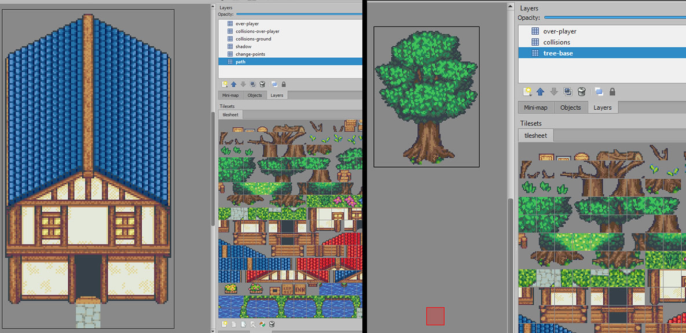
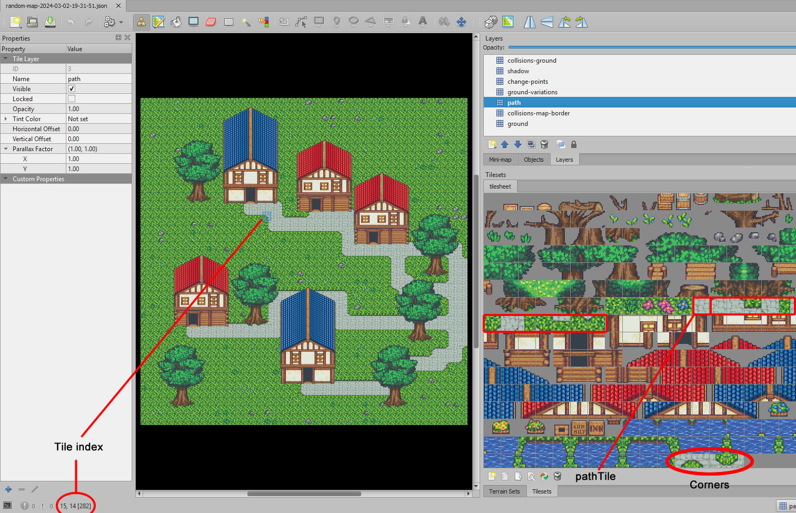

# The "objects" approach

For this, the simple part is the name conventions, since you need to create a new Tiled-Map per element on the map the naming is almost the same in every file. The tool later will pick up each of these to generate the random map and merge the required data from each element.



As you can see in the screenshot above, each element for the map is a different file and the conventions are the described ones.

Also, you can note the "path" layer consist in a single tile below the house door. That tile will be use to join the current element with the main path on the generated map.

All these assets are available as well in the examples folder (in the packages and GitHub):

https://github.com/damian-pastorini/tile-map-generator/tree/master/examples/layer-elements-object

The next step is to generate the script, which is the most "complex" part for this approach.

The problem here is that we need to define everything manually on the script:

- You need to require each map file.
- Then specify every element quantity.
- Then define every single tile index for every randomize part: pathTile, groundTile, randomGroundTiles, surroundingTiles and corners.

In the examples, the `groundTile` will be the grass, the `pathTile` will be the full floor tile, the `surroundingTiles` are the ones used to wrap the path, and the `corners` are for the crossing paths.

**One IMPORTANT note here is: you need to +1 to the tile index display in the Tiled app**, in the following screenshot the correct tile index for the marked tile is not 282 but 283, this is because how the layers are later build




Here's the example script for the map randomizer:

```js
const { RandomMapGenerator } = require('@reldens/tile-map-generator');
const { layerElements } = require('./layer-elements');

const mapData = {
    rootFolder: __dirname,
    tileSize: 32,
    tileSheetPath: 'tilesheet.png',
    tileSheetName: 'tilesheet.png',
    imageHeight: 578,
    imageWidth: 612,
    tileCount: 306,
    columns: 18,
    margin: 1,
    spacing: 2,
    // tiles: [],
    layerElements,
    elementsQuantity: {house1: 3, house2: 2, tree: 6},
    groundTile: 116,
    mainPathSize: 3,
    blockMapBorder: true,
    freeSpaceTilesQuantity: 2,
    variableTilesPercentage: 15,
    pathTile: 121,
    collisionLayersForPaths: ['change-points', 'collisions', 'tree-base'],
    randomGroundTiles: [26, 27, 28, 29, 30, 36, 37, 38, 39, 50, 51, 52, 53],
    surroundingTiles: {
        '-1,-1': 127, // top-left
        '-1,0': 124, // top-center
        '-1,1': 130, // top-right
        '0,-1': 126, // middle-left
        // '0,0': 121, // middle-center
        '0,1': 129, // middle-right
        '1,-1': 132, // bottom-left
        '1,0': 131, // bottom-center
        '1,1': 133, // bottom-right
    },
    corners: {
        '-1,-1': 285, // top-left
        '-1,1': 284, // top-right
        '1,-1': 283, // bottom-left
        '1,1': 282, // bottom-right
    }
};

const generator = new RandomMapGenerator(mapData);

generator.generate();
```

By running this script with:

```
$ node ./generate.js
```

You will get as many map variations you want.

[Objects map 001](screenshots/objects-map-001.png)
[Objects map 002](screenshots/objects-map-002.png)
[Objects map 003](screenshots/objects-map-003.png)
[Objects map 004](screenshots/objects-map-004.png)
